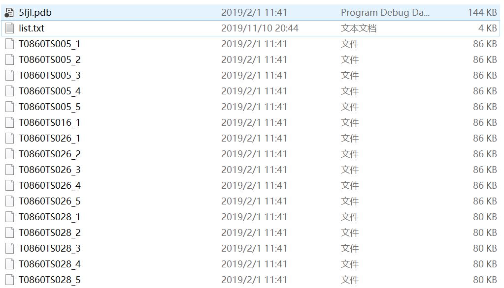

# Decoy Sets Used in NEPRE
NEPRE uses several excellent decoy sets that generated by some famous research group or competition. Sincerely thanks to their help!
## CASP12
CASP12 contains 146 targets totally. 39 targets which use **X-RAY DIFFRACTION** with resolution **<= 3Å** are used to validate NEPRE.  

Total CASP12 Decoy Set can be found by visiting [CASP](http://predictioncenter.org/).  
  
The **39** targets used in NEPRE can be obtained in **casp12.rar**. Figure1 shows a example of target list contained in each decoy folder.

 

Fig1. File list in each target. 

## ROSETTA

## MODELLER

## 3DRobot

## I-TASSER

